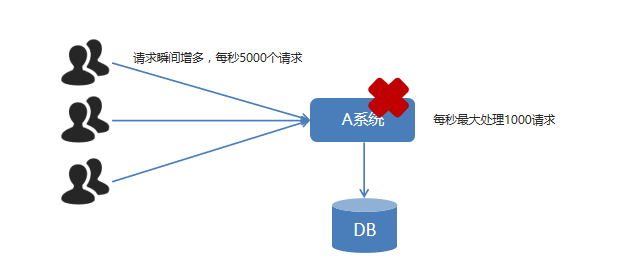

[toc]

## MQ基本概念

### 1. MQ概述

> `MQ全称 Message Queue（消息队列）`，是在消息的传输过程中保存消息的容器。`多`用于`分布式系统之间进行通信。`

> 使用MQ中间件

> 小结：
>
> 1. MQ—消息队列，存储消息的中间件。
> 2. 分布式系统通信两种方式：`直接远程调用`和==借助第三方完成间接通信==。
> 3. 发送方称为生产者，接收方称为消费者。

### 2. MQ的优势和劣势

#### 2.1 优势

> 1. 应用解耦：提高系统容错性和可维护性。
> 2. 异步提速：提升用户体验和系统吞吐量。
> 3. 削峰填谷：提高系统稳定性。

###### 应用解耦

系统的耦合性越高，容错性就越低，可维护性就越低。

使用 MQ 使得应用间解耦，提升容错性和可维护性。

###### 异步提速

一个下单操作耗时：20 + 300 + 300 + 300 = 920ms
用户点击完下单按钮后，需要等待920ms才能得到下单响应，太慢！

用户点击完下单按钮后，只需等待25ms就能得到下单响应 (20 + 5 = 25ms)。
`提升用户体验和系统吞吐量（单位时间内处理请求的数目）。`

###### 削峰填谷

使用了 MQ 之后，限制消费消息的速度为1000，这样一来，高峰期产生的数据势必会被积压在 MQ 中，高峰就被“削”掉了，但是因为消息积压，在高峰期过后的一段时间内，消费消息的速度还是会维持在1000，直到消费完积压的消息，这就叫做`“填谷”`。
`使用MQ后，可以提高系统稳定性。`

#### 2.2 劣势

###### 系统可用性降低

系统引入的外部依赖越多，系统稳定性越差。一旦 MQ 宕机，就会对业务造成影响。如何保证MQ的高可用？

###### 系统复杂度提高

MQ 的加入大大增加了系统的复杂度，以前系统间是同步的远程调用，现在是通过 MQ 进行异步调用。如何保证消息没有被重复消费？怎么处理消息丢失情况？那么保证消息传递的顺序性？

###### 一致性问题

A 系统处理完业务，通过 MQ 给B、C、D三个系统发消息数据，如果 B 系统、C 系统处理成功，D 系统处理失败。如何保证消息数据处理的一致性？

#### 2.3 既然 MQ 有优势也有劣势，那么使用 MQ 需要满足什么条件呢？

1. 生产者不需要从消费者处获得反馈。引入消息队列之前的直接调用，其接口的返回值应该为空，这才让明明下层的动作还没做，上层却当成动作做完了继续往后走，即所谓异步成为了可能。
2. 容许短暂的不一致性。
3. 确实是用了有效果。即解耦、提速、削峰这些方面的收益，超过加入MQ，管理MQ这些成本。

### 3. 常见的MQ产品

> 目前业界有很多的 MQ 产品，例如 `RabbitMQ`、RocketMQ、`ActiveMQ、Kafka`、ZeroMQ、MetaMq等，也有直接使用 Redis 充当消息队列的案例，而这些消息队列产品，各有侧重，在实际选型时，需要结合自身需求及 MQ 产品特征，综合考虑。

## ☆