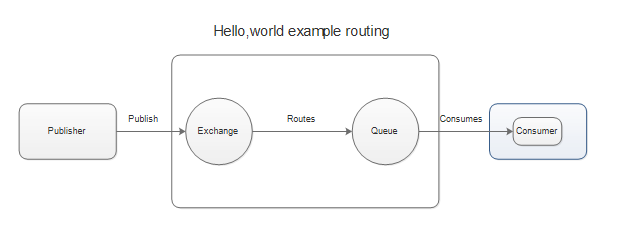
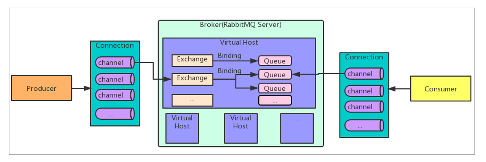

[toc]

## RabbitMQ基本介绍

`AMQP，即 Advanced Message Queuing Protocol（高级消息队列协议），是一个网络协议`，是`应用层协议`的一个开放标准，为面向消息的中间件设计。基于此协议的客户端与消息中间件可传递消息，并不受客户端/中间件不同产品，不同的开发语言等条件的限制。`2006年，AMQP 规范发布。类比HTTP。`

2007年，Rabbit 技术公司基于 AMQP 标准开发的 RabbitMQ 1.0 发布。RabbitMQ 采用 Erlang 语言开发。`Erlang 语言由 Ericson 设计，专门为开发高并发和分布式系统的一种语言，在电信领域使用广泛。`

### 1. RabbitMQ 基础架构

### 2. RabbitMQ 中的相关概念

`Broker：`接收和分发消息的应用，`RabbitMQ Server就是 Message Broker。`

`Virtual host：`出于多租户和安全因素设计的，把 AMQP 的基本组件划分到一个虚拟的分组中，类似于网络中的 namespace 概念。当多个不同的用户使用同一个 RabbitMQ server 提供的服务时，可以划分出多个vhost，每个用户在自己的 vhost 创建 exchange／queue 等。

`Connection：`publisher／consumer 和 broker 之间的 TCP 连接。

`Channel：`如果每一次访问 RabbitMQ 都建立一个 Connection，在消息量大的时候建立 TCP Connection的开销将是巨大的，效率也较低。Channel 是在 connection 内部建立的逻辑连接，如果应用程序支持多线程，通常每个thread创建单独的 channel 进行通讯，AMQP method 包含了channel id 帮助客户端和message broker 识别 channel，所以 channel 之间是完全隔离的。Channel 作为轻量级的 Connection 极大减少了操作系统建立 TCP connection 的开销。

`Exchange：`message 到达 broker 的第一站，根据分发规则，`匹配查询表中的 routing key，`分发消息到queue 中去。常用的类型有：

- `direct (point-to-point)`
- `topic (publish-subscribe)` 
- `fanout (multicast)`

`Queue：`消息最终被送到这里等待 consumer 取走

`Binding：`exchange 和 queue 之间的虚拟连接，binding 中可以包含 routing key。Binding 信息被保存到 exchange 中的查询表中，用于 message 的分发依据

### 3. RabbitMQ的6 种工作模式

RabbitMQ 提供了 6 种工作模式：

==简单模式、work queues、Publish/Subscribe 发布与订阅模式、Routing 路由模式、Topics 主题模式、RPC 远程调用模式（远程调用，不太算 MQ；暂不作介绍）。==

官网对应模式介绍：https://www.rabbitmq.com/getstarted.html

### 4. AMQP 和 JMS

MQ是消息通信的模型；`实现MQ的大致有两种主流方式：AMQP、JMS。`

#### 4.1 AMQP

AMQP是一种协议，更准确的说是一种binary wire-level protocol（链接协议）。这是其和JMS的本质差别，AMQP不从API层进行限定，而是直接定义网络交换的数据格式。

#### 4.2 JMS

`JMS即Java消息服务（JavaMessage Service）应用程序接口，`是一个Java平台中关于面向消息中间件（MOM）的API，用于在两个应用程序之间，或分布式系统中发送消息，进行异步通信。

 JMS 是 JavaEE 规范中的一种，类比JDBC。

#### 4.3 AMQP 与 JMS 区别☆

JMS是定义了统一的接口，来对消息操作进行统一；AMQP是通过规定协议来统一数据交互的格式

JMS限定了必须使用Java语言；AMQP只是协议，不规定实现方式，因此是跨语言的。

JMS规定了两种消息模式；而AMQP的消息模式更加丰富

#### 4.4 再谈市场上常见的消息队列

ActiveMQ：基于JMS

ZeroMQ：基于C语言开发

RabbitMQ：基于AMQP协议，erlang语言开发，稳定性好

RocketMQ：基于JMS，阿里巴巴产品

Kafka：类似MQ的产品；分布式消息系统，高吞吐量。

## ☆

