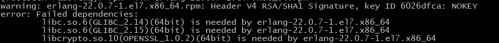

[toc]

## RabbitMQ的安装和配置

https://blog.csdn.net/Kermit_father/article/details/105181740

### 1. 安装依赖环境

在线安装依赖环境：

```shell
yum install build-essential openssl openssl-devel unixODBC unixODBC-devel make gcc gcc-c++ kernel-devel m4 ncurses-devel tk tc xz
```

### 2. 安装Erlang

上传下面三个安装包

`erlang-18.3-1.el7.centos.x86_64.rpm`

`socat-1.7.3.2-5.el7.lux.x86_64.rpm`

`rabbitmq-server-3.6.5-1.noarch.rpm`

```sh
#下载erlang
wget www.rabbitmq.com/releases/erlang/erlang-18.3-1.el7.centos.x86_64.rpm

#下载socat
wget http://repo.iotti.biz/CentOS/7/x86_64/socat-1.7.3.2-5.el7.lux.x86_64.rpm

#下载rabbitmq-server
wget www.rabbitmq.com/releases/rabbitmq-server/v3.6.5/rabbitmq-server-3.6.5-1.noarch.rpm

# 安装
rpm -ivh erlang-18.3-1.el7.centos.x86_64.rpm
```

如果出现如下错误



说明gblic 版本太低。我们可以查看当前机器的gblic 版本

```shell
strings /lib64/libc.so.6 | grep GLIBC
```


当前最高版本2.12，需要2.15.所以需要升级glibc

- 使用yum更新安装依赖

  ```shell
  sudo yum install zlib-devel bzip2-devel openssl-devel ncurses-devel sqlite-devel readline-devel tk-devel gcc make -y
  ```

- 下载rpm包

  ```shell
  wget http://copr-be.cloud.fedoraproject.org/results/mosquito/myrepo-el6/epel-6-x86_64/glibc-2.17-55.fc20/glibc-utils-2.17-55.el6.x86_64.rpm &
  wget http://copr-be.cloud.fedoraproject.org/results/mosquito/myrepo-el6/epel-6-x86_64/glibc-2.17-55.fc20/glibc-static-2.17-55.el6.x86_64.rpm &
  wget http://copr-be.cloud.fedoraproject.org/results/mosquito/myrepo-el6/epel-6-x86_64/glibc-2.17-55.fc20/glibc-2.17-55.el6.x86_64.rpm &
  wget http://copr-be.cloud.fedoraproject.org/results/mosquito/myrepo-el6/epel-6-x86_64/glibc-2.17-55.fc20/glibc-common-2.17-55.el6.x86_64.rpm &
  wget http://copr-be.cloud.fedoraproject.org/results/mosquito/myrepo-el6/epel-6-x86_64/glibc-2.17-55.fc20/glibc-devel-2.17-55.el6.x86_64.rpm &
  wget http://copr-be.cloud.fedoraproject.org/results/mosquito/myrepo-el6/epel-6-x86_64/glibc-2.17-55.fc20/glibc-headers-2.17-55.el6.x86_64.rpm &
  wget http://copr-be.cloud.fedoraproject.org/results/mosquito/myrepo-el6/epel-6-x86_64/glibc-2.17-55.fc20/nscd-2.17-55.el6.x86_64.rpm &
  ```

- 安装rpm包

  ```shell
  sudo rpm -Uvh *-2.17-55.el6.x86_64.rpm --force --nodeps
  ```

- 安装完毕后再查看glibc版本,发现glibc版本已经到2.17了

  ```shell
  strings /lib64/libc.so.6 | grep GLIBC
  ```

  

  


### 3. 安装RabbitMQ

```sh
# 安装
rpm -ivh socat-1.7.3.2-5.el7.lux.x86_64.rpm

# 安装
rpm -ivh rabbitmq-server-3.6.5-1.noarch.rpm
```


### 4. 开启管理界面及配置

```sh
# 开启管理界面
rabbitmq-plugins enable rabbitmq_management
# 修改默认配置信息 
vim rabbitmq/lib/rabbitmq_server-3.6.5/ebin/rabbit.app 
# 比如修改密码、配置等等，例如：loopback_users 中的 <<"guest">>,只保留guest
```


### 5. 启动

```sh
systemctl start rabbitmq-server  # 启动服务
systemctl stop rabbitmq-server  # 停止服务
systemctl restart rabbitmq-server  # 重启服务
systemctl status rabbitmq-server
```

设置配置文件

```shell
cd /usr/share/doc/rabbitmq-server-3.6.5/

cp rabbitmq.config.example /etc/rabbitmq/rabbitmq.config
```

启动rabbitmq

~~~~shell
cd /usr/lib/rabbitmq/lib/rabbitmq_server-3.6.5/ebin
 
rabbitmq-server start &
~~~~

常用命令

~~~~shell
  rabbitmq-server -deched  --后台启动节点
 
  rabbitmqctl stop_app --关闭节点上的应用
 
  rabbitmqctl start_app --启动节点上的应用
 
  rabbitmqctl stop --关闭节点
~~~~


> 修改了用户名之后，重启服务器造成创建用户丢失：
>
> 因为rabbitmq数据是根据当前hostname作为node节点作为数据名保存，这一点可以从rabbitmq-env文件中可以看出。
>
> 解决方案：
>
> 1. 不要更改hostname
> 2. https://blog.csdn.net/qq_27037443/article/details/78050526

### 6. 配置虚拟主机及用户

#### 6.1 用户角色

RabbitMQ在安装好后，可以访问`http://ip地址:15672` ；其自带了guest/guest的用户名和密码；如果需要创建自定义用户；那么也可以登录管理界面后，如下操作：

 


**角色说明**：

1、 超级管理员(administrator)

可登陆管理控制台，可查看所有的信息，并且可以对用户，策略(policy)进行操作。

2、 监控者(monitoring)

可登陆管理控制台，同时可以查看rabbitmq节点的相关信息(进程数，内存使用情况，磁盘使用情况等)

3、 策略制定者(policymaker)

可登陆管理控制台, 同时可以对policy进行管理。但无法查看节点的相关信息(上图红框标识的部分)。

4、 普通管理者(management)

仅可登陆管理控制台，无法看到节点信息，也无法对策略进行管理。

5、 其他

无法登陆管理控制台，通常就是普通的生产者和消费者。

#### 6.2 Virtual Hosts配置

`像mysql拥有数据库的概念并且可以指定用户对库和表等操作的权限。RabbitMQ也有类似的权限管理；`在RabbitMQ中可以虚拟消息服务器Virtual Host，每个Virtual Hosts相当于一个相对独立的RabbitMQ服务器，每个VirtualHost之间是相互隔离的。exchange、queue、message不能互通。 相当于mysql的db。Virtual Name一般以/开头。

###### 创建Virtual Hosts


###### 设置Virtual Hosts权限


## ☆