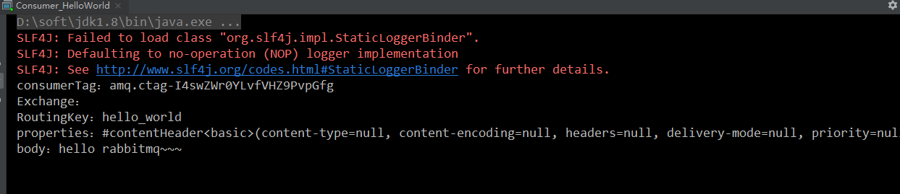

[toc]

## RabbitMQ入门

### 1. 搭建示例工程

#### 1.1 创建工程


#### 1.2 添加依赖

往heima-rabbitmq的pom.xml文件中添加如下依赖：

```xml
        <dependency>
            <groupId>com.rabbitmq</groupId>
            <artifactId>amqp-client</artifactId>
            <version>5.6.0</version>
        </dependency>
```

### 2. 编写生产者

编写消息生产者com.itheima.producer.Producer_HelloWorld;

```java
package com.itheima.producer;

import com.rabbitmq.client.Channel;
import com.rabbitmq.client.Connection;
import com.rabbitmq.client.ConnectionFactory;

import java.io.IOException;
import java.util.concurrent.TimeoutException;

/**
 * 发送消息
 */
public class Producer_HelloWorld {
    public static void main(String[] args) throws IOException, TimeoutException {
        //1.创建连接工厂
        ConnectionFactory factory = new ConnectionFactory();

        //2. 设置参数
        factory.setHost("106.15.72.229");//ip  默认值 localhost
        factory.setPort(5672); //端口  默认值 5672
        factory.setVirtualHost("/itcast");//虚拟机 默认值/
        factory.setUsername("heima");//用户名 默认 guest
        factory.setPassword("heima");//密码 默认值 guest
        //3. 创建连接 Connection
        Connection connection = factory.newConnection();
        //4. 创建Channel
        Channel channel = connection.createChannel();
        //5. 创建队列Queue
        /*
        queueDeclare(String queue, boolean durable, boolean exclusive, boolean autoDelete, Map<String, Object> arguments)
        参数：
            1. queue：队列名称
            2. durable:是否持久化，当mq重启之后，还在
            3. exclusive：
                * 是否独占。只能有一个消费者监听这队列
                * 当Connection关闭时，是否删除队列
                *
            4. autoDelete:是否自动删除。当没有Consumer时，自动删除掉
            5. arguments：参数。

         */
        //如果没有一个名字叫hello_world的队列，则会创建该队列，如果有则不会创建
        channel.queueDeclare("hello_world", true, false, false, null);
        /*
        basicPublish(String exchange, String routingKey, BasicProperties props, byte[] body)
        参数：
            1. exchange：交换机名称。简单模式下交换机会使用默认的 ""
            2. routingKey：路由名称
            3. props：配置信息
            4. body：发送消息数据

         */

        String body = "hello rabbitmq~~~";

        //6. 发送消息
        channel.basicPublish("", "hello_world", null, body.getBytes());


        //7.释放资源
        channel.close();
        connection.close();

    }
}
```


在执行上述的消息发送之后；可以登录rabbitMQ的管理控制台，可以发现队列和其消息：


### 3. 编写消费者

编写消息的消费者com.itheima.consumer.Consumer_HelloWorld;

```java
package com.itheima.consumer;

import com.rabbitmq.client.*;

import java.io.IOException;
import java.util.concurrent.TimeoutException;

public class Consumer_HelloWorld {
    public static void main(String[] args) throws IOException, TimeoutException {

        //1.创建连接工厂
        ConnectionFactory factory = new ConnectionFactory();
        //2. 设置参数
        factory.setHost("106.15.72.229");//ip  默认值 localhost
        factory.setPort(5672); //端口  默认值 5672
        factory.setVirtualHost("/itcast");//虚拟机 默认值/
        factory.setUsername("heima");//用户名 默认 guest
        factory.setPassword("heima");//密码 默认值 guest
        //3. 创建连接 Connection
        Connection connection = factory.newConnection();
        //4. 创建Channel
        Channel channel = connection.createChannel();
        //5. 创建队列Queue
        /*
        queueDeclare(String queue, boolean durable, boolean exclusive, boolean autoDelete, Map<String, Object> arguments)
        参数：
            1. queue：队列名称
            2. durable:是否持久化，当mq重启之后，还在
            3. exclusive：
                * 是否独占。只能有一个消费者监听这队列
                * 当Connection关闭时，是否删除队列
                *
            4. autoDelete:是否自动删除。当没有Consumer时，自动删除掉
            5. arguments：参数。

         */
        //如果没有一个名字叫hello_world的队列，则会创建该队列，如果有则不会创建
        channel.queueDeclare("hello_world",true,false,false,null);

        /*
        basicConsume(String queue, boolean autoAck, Consumer callback)
        参数：
            1. queue：队列名称
            2. autoAck：是否自动确认
            3. callback：回调对象

         */
        // 接收消息
        Consumer consumer = new DefaultConsumer(channel){
            /*
                回调方法，当收到消息后，会自动执行该方法

                1. consumerTag：标识
                2. envelope：获取一些信息，交换机，路由key...
                3. properties:配置信息
                4. body：数据

             */
            @Override
            public void handleDelivery(String consumerTag, Envelope envelope, AMQP.BasicProperties properties, byte[] body) throws IOException {
                System.out.println("consumerTag："+consumerTag);
                System.out.println("Exchange："+envelope.getExchange());
                System.out.println("RoutingKey："+envelope.getRoutingKey());
                System.out.println("properties："+properties);
                System.out.println("body："+new String(body));
            }
        };
        channel.basicConsume("hello_world",true,consumer);


        //关闭资源？不要

    }
}
```




### 4. 小结

抽取创建connection的工具类com.itheima.util.ConnectionUtil；

```java
package com.itheima.rabbitmq.util;

import com.rabbitmq.client.Connection;
import com.rabbitmq.client.ConnectionFactory;

public class ConnectionUtil {

    public static Connection getConnection() throws Exception {
        //创建连接工厂
        ConnectionFactory connectionFactory = new ConnectionFactory();
        //主机地址;默认为 localhost
        connectionFactory.setHost("106.15.72.229");
        //连接端口;默认为 5672
        connectionFactory.setPort(5672);
        //虚拟主机名称;默认为 /
        connectionFactory.setVirtualHost("/itcast");
        //连接用户名；默认为guest
        connectionFactory.setUsername("heima");
        //连接密码；默认为guest
        connectionFactory.setPassword("heima");

        //创建连接
        return connectionFactory.newConnection();
    }
}
```

上述的入门案例中中其实使用的是如下的`简单模式：`


在上图的模型中，有以下概念：

- P：生产者，也就是要发送消息的程序
- C：消费者：消息的接受者，会一直等待消息到来。
- queue：消息队列，图中红色部分。类似一个邮箱，可以缓存消息；生产者向其中投递消息，消费者从其中取出消息。

## ☆