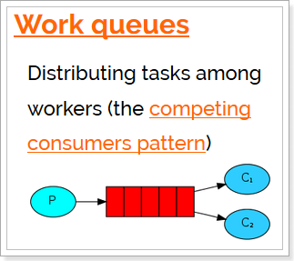
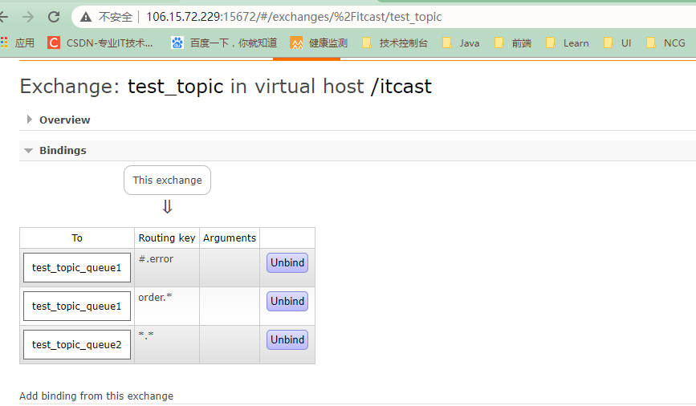

[toc]

# RabbitMQ工作模式

官网对应模式介绍：https://www.rabbitmq.com/getstarted.html


## 1. Work queues工作队列模式

### 1.1 模式说明



`Work Queues`与入门程序的`简单模式`相比，多了一个或一些消费端，多个消费端共同消费同一个队列中的消息。

`应用场景`：对于 任务过重或任务较多情况使用工作队列可以提高任务处理的速度。

### 1.2 代码

`Work Queues`与入门程序的`简单模式`的代码是几乎一样的；可以完全复制，并复制多一个消费者进行多个消费者同时消费消息的测试。

#### 生产者

```java
package com.itheima.producer;

import com.rabbitmq.client.Channel;
import com.rabbitmq.client.Connection;
import com.rabbitmq.client.ConnectionFactory;

import java.io.IOException;
import java.util.concurrent.TimeoutException;

/**
 * 发送消息
 */
public class Producer_WorkQueues {
    public static void main(String[] args) throws IOException, TimeoutException {

        //1.创建连接工厂
        ConnectionFactory factory = new ConnectionFactory();
        //2. 设置参数
        factory.setHost("106.15.72.229");//ip  默认值 localhost
        factory.setPort(5672); //端口  默认值 5672
        factory.setVirtualHost("/itcast");//虚拟机 默认值/
        factory.setUsername("heima");//用户名 默认 guest
        factory.setPassword("heima");//密码 默认值 guest
        //3. 创建连接 Connection
        Connection connection = factory.newConnection();
        //4. 创建Channel
        Channel channel = connection.createChannel();

        //5. 创建队列Queue
        /*
        queueDeclare(String queue, boolean durable, boolean exclusive, boolean autoDelete, Map<String, Object> arguments)
        参数：
            1. queue：队列名称
            2. durable:是否持久化，当mq重启之后，还在
            3. exclusive：
                * 是否独占。只能有一个消费者监听这队列
                * 当Connection关闭时，是否删除队列
                *
            4. autoDelete:是否自动删除。当没有Consumer时，自动删除掉
            5. arguments：参数。

         */
        //如果没有一个名字叫hello_world的队列，则会创建该队列，如果有则不会创建
        channel.queueDeclare("work_queues", true, false, false, null);
        /*
        basicPublish(String exchange, String routingKey, BasicProperties props, byte[] body)
        参数：
            1. exchange：交换机名称。简单模式下交换机会使用默认的 ""
            2. routingKey：路由名称
            3. props：配置信息
            4. body：发送消息数据

         */
        for (int i = 1; i <= 10; i++) {
            String body = i + "hello rabbitmq~~~";

            //6. 发送消息
            channel.basicPublish("", "work_queues", null, body.getBytes());
        }


        //7.释放资源
        channel.close();
        connection.close();

    }
}
```


#### 消费者1

```java
package com.itheima.consumer;

import com.rabbitmq.client.*;

import java.io.IOException;
import java.util.concurrent.TimeoutException;

public class Consumer_WorkQueues1 {
    public static void main(String[] args) throws IOException, TimeoutException {

        //1.创建连接工厂
        ConnectionFactory factory = new ConnectionFactory();
        //2. 设置参数
        factory.setHost("106.15.72.229");//ip  默认值 localhost
        factory.setPort(5672); //端口  默认值 5672
        factory.setVirtualHost("/itcast");//虚拟机 默认值/
        factory.setUsername("heima");//用户名 默认 guest
        factory.setPassword("heima");//密码 默认值 guest
        //3. 创建连接 Connection
        Connection connection = factory.newConnection();
        //4. 创建Channel
        Channel channel = connection.createChannel();
        //5. 创建队列Queue
        /*
        queueDeclare(String queue, boolean durable, boolean exclusive, boolean autoDelete, Map<String, Object> arguments)
        参数：
            1. queue：队列名称
            2. durable:是否持久化，当mq重启之后，还在
            3. exclusive：
                * 是否独占。只能有一个消费者监听这队列
                * 当Connection关闭时，是否删除队列
                *
            4. autoDelete:是否自动删除。当没有Consumer时，自动删除掉
            5. arguments：参数。

         */
        //如果没有一个名字叫hello_world的队列，则会创建该队列，如果有则不会创建
        channel.queueDeclare("work_queues",true,false,false,null);

        /*
        basicConsume(String queue, boolean autoAck, Consumer callback)
        参数：
            1. queue：队列名称
            2. autoAck：是否自动确认
            3. callback：回调对象

         */
        // 接收消息
        Consumer consumer = new DefaultConsumer(channel){
            /*
                回调方法，当收到消息后，会自动执行该方法

                1. consumerTag：标识
                2. envelope：获取一些信息，交换机，路由key...
                3. properties:配置信息
                4. body：数据

             */
            @Override
            public void handleDelivery(String consumerTag, Envelope envelope, AMQP.BasicProperties properties, byte[] body) throws IOException {
              /*  System.out.println("consumerTag："+consumerTag);
                System.out.println("Exchange："+envelope.getExchange());
                System.out.println("RoutingKey："+envelope.getRoutingKey());
                System.out.println("properties："+properties);*/
                System.out.println("body："+new String(body));
            }
        };
        channel.basicConsume("work_queues",true,consumer);


        //关闭资源？不要

    }
}
```

#### 消费者2

```java
package com.itheima.consumer;

import com.rabbitmq.client.*;

import java.io.IOException;
import java.util.concurrent.TimeoutException;

public class Consumer_WorkQueues2 {
    public static void main(String[] args) throws IOException, TimeoutException {

        //1.创建连接工厂
        ConnectionFactory factory = new ConnectionFactory();
        //2. 设置参数
        factory.setHost("106.15.72.229");//ip  默认值 localhost
        factory.setPort(5672); //端口  默认值 5672
        factory.setVirtualHost("/itcast");//虚拟机 默认值/
        factory.setUsername("heima");//用户名 默认 guest
        factory.setPassword("heima");//密码 默认值 guest
        //3. 创建连接 Connection
        Connection connection = factory.newConnection();
        //4. 创建Channel
        Channel channel = connection.createChannel();
        //5. 创建队列Queue
        /*
        queueDeclare(String queue, boolean durable, boolean exclusive, boolean autoDelete, Map<String, Object> arguments)
        参数：
            1. queue：队列名称
            2. durable:是否持久化，当mq重启之后，还在
            3. exclusive：
                * 是否独占。只能有一个消费者监听这队列
                * 当Connection关闭时，是否删除队列
                *
            4. autoDelete:是否自动删除。当没有Consumer时，自动删除掉
            5. arguments：参数。

         */
        //如果没有一个名字叫hello_world的队列，则会创建该队列，如果有则不会创建
        channel.queueDeclare("work_queues", true, false, false, null);

        /*
        basicConsume(String queue, boolean autoAck, Consumer callback)
        参数：
            1. queue：队列名称
            2. autoAck：是否自动确认
            3. callback：回调对象

         */
        // 接收消息
        Consumer consumer = new DefaultConsumer(channel) {
            /*
                回调方法，当收到消息后，会自动执行该方法

                1. consumerTag：标识
                2. envelope：获取一些信息，交换机，路由key...
                3. properties:配置信息
                4. body：数据

             */
            @Override
            public void handleDelivery(String consumerTag, Envelope envelope, AMQP.BasicProperties properties, byte[] body) throws IOException {
              /*  System.out.println("consumerTag："+consumerTag);
                System.out.println("Exchange："+envelope.getExchange());
                System.out.println("RoutingKey："+envelope.getRoutingKey());
                System.out.println("properties："+properties);*/
                System.out.println("body：" + new String(body));
            }
        };
        channel.basicConsume("work_queues", true, consumer);


        //关闭资源？不要

    }
}
```


### 1.3 测试

启动两个消费者，然后再启动生产者发送消息；到IDEA的两个消费者对应的控制台查看是否竞争性的接收到消息。


### 1.4 小结

在一个队列中如果有多个消费者，那么消费者之间对于同一个消息的关系是`竞争`的关系。

## 2. 订阅模式类型☆

订阅模式示例图：


前面2个案例中，只有3个角色：

- P：生产者，也就是要发送消息的程序
- C：消费者：消息的接受者，会一直等待消息到来。
- queue：消息队列，图中红色部分


而在订阅模型中，多了一个exchange角色，而且过程略有变化：

- P：生产者，也就是要发送消息的程序，但是不再发送到队列中，而是发给X（交换机）
- C：消费者，消息的接受者，会一直等待消息到来。
- Queue：消息队列，接收消息、缓存消息。
- Exchange：交换机，图中的X。一方面，接收生产者发送的消息。另一方面，知道如何处理消息，例如递交给某个特别队列、递交给所有队列、或是将消息丢弃。到底如何操作，取决于Exchange的类型。Exchange有常见以下3种类型：
  - Fanout：广播，将消息交给所有绑定到交换机的队列
  - Direct：定向，把消息交给符合指定routing key 的队列
  - Topic：通配符，把消息交给符合routing pattern（路由模式） 的队列

`Exchange（交换机）只负责转发消息，不具备存储消息的能力`，因此如果没有任何队列与Exchange绑定，或者没有符合路由规则的队列，那么消息会丢失！


## 3. Publish/Subscribe发布与订阅模式

### 3.1 模式说明


发布订阅模式：
1、每个消费者监听自己的队列。
2、生产者将消息发给broker，由交换机将消息转发到绑定此交换机的每个队列，每个绑定交换机的队列都将接收
到消息。

### 3.2. 代码

#### 生产者

```java
package com.itheima.producer;

import com.rabbitmq.client.BuiltinExchangeType;
import com.rabbitmq.client.Channel;
import com.rabbitmq.client.Connection;
import com.rabbitmq.client.ConnectionFactory;

import java.io.IOException;
import java.util.concurrent.TimeoutException;

/**
 * 发送消息
 */
public class Producer_PubSub {
    public static void main(String[] args) throws IOException, TimeoutException {

        //1.创建连接工厂
        ConnectionFactory factory = new ConnectionFactory();
        //2. 设置参数
        factory.setHost("106.15.72.229");//ip  默认值 localhost
        factory.setPort(5672); //端口  默认值 5672
        factory.setVirtualHost("/itcast");//虚拟机 默认值/
        factory.setUsername("heima");//用户名 默认 guest
        factory.setPassword("heima");//密码 默认值 guest
        //3. 创建连接 Connection
        Connection connection = factory.newConnection();
        //4. 创建Channel
        Channel channel = connection.createChannel();
       /*

       exchangeDeclare(String exchange, BuiltinExchangeType type, boolean durable, boolean autoDelete, boolean internal, Map<String, Object> arguments)
       参数：
        1. exchange:交换机名称
        2. type:交换机类型
            DIRECT("direct"),：定向
            FANOUT("fanout"),：扇形（广播），发送消息到每一个与之绑定队列。
            TOPIC("topic"),通配符的方式
            HEADERS("headers");参数匹配

        3. durable:是否持久化
        4. autoDelete:自动删除
        5. internal：内部使用。 一般false
        6. arguments：参数
        */

        String exchangeName = "test_fanout";
        //5. 创建交换机
        channel.exchangeDeclare(exchangeName, BuiltinExchangeType.FANOUT, true, false, false, null);
        //6. 创建队列
        String queue1Name = "test_fanout_queue1";
        String queue2Name = "test_fanout_queue2";
        channel.queueDeclare(queue1Name, true, false, false, null);
        channel.queueDeclare(queue2Name, true, false, false, null);
        //7. 绑定队列和交换机
        /*
        queueBind(String queue, String exchange, String routingKey)
        参数：
            1. queue：队列名称
            2. exchange：交换机名称
            3. routingKey：路由键，绑定规则
                如果交换机的类型为fanout ，routingKey设置为""
         */
        channel.queueBind(queue1Name, exchangeName, "");
        channel.queueBind(queue2Name, exchangeName, "");

        String body = "日志信息：张三调用了findAll方法...日志级别：info...";
        //8. 发送消息
        channel.basicPublish(exchangeName, "", null, body.getBytes());

        //9. 释放资源
        channel.close();
        connection.close();

    }
}
```

#### 消费者1

```java
package com.itheima.consumer;

import com.rabbitmq.client.*;

import java.io.IOException;
import java.util.concurrent.TimeoutException;

public class Consumer_PubSub1 {
    public static void main(String[] args) throws IOException, TimeoutException {

        //1.创建连接工厂
        ConnectionFactory factory = new ConnectionFactory();
        //2. 设置参数
        factory.setHost("106.15.72.229");//ip  默认值 localhost
        factory.setPort(5672); //端口  默认值 5672
        factory.setVirtualHost("/itcast");//虚拟机 默认值/
        factory.setUsername("heima");//用户名 默认 guest
        factory.setPassword("heima");//密码 默认值 guest
        //3. 创建连接 Connection
        Connection connection = factory.newConnection();
        //4. 创建Channel
        Channel channel = connection.createChannel();


        String queue1Name = "test_fanout_queue1";
        String queue2Name = "test_fanout_queue2";


        /*
        basicConsume(String queue, boolean autoAck, Consumer callback)
        参数：
            1. queue：队列名称
            2. autoAck：是否自动确认
            3. callback：回调对象

         */
        // 接收消息
        Consumer consumer = new DefaultConsumer(channel){
            /*
                回调方法，当收到消息后，会自动执行该方法

                1. consumerTag：标识
                2. envelope：获取一些信息，交换机，路由key...
                3. properties:配置信息
                4. body：数据

             */
            @Override
            public void handleDelivery(String consumerTag, Envelope envelope, AMQP.BasicProperties properties, byte[] body) throws IOException {
              /*  System.out.println("consumerTag："+consumerTag);
                System.out.println("Exchange："+envelope.getExchange());
                System.out.println("RoutingKey："+envelope.getRoutingKey());
                System.out.println("properties："+properties);*/
                System.out.println("body："+new String(body));
                System.out.println("将日志信息打印到控制台.....");
            }
        };
        channel.basicConsume(queue1Name,true,consumer);


        //关闭资源？不要

    }
}
```

#### 消费者2

```java
package com.itheima.consumer;

import com.rabbitmq.client.*;

import java.io.IOException;
import java.util.concurrent.TimeoutException;

public class Consumer_PubSub2 {
    public static void main(String[] args) throws IOException, TimeoutException {

        //1.创建连接工厂
        ConnectionFactory factory = new ConnectionFactory();
        //2. 设置参数
        factory.setHost("106.15.72.229");//ip  默认值 localhost
        factory.setPort(5672); //端口  默认值 5672
        factory.setVirtualHost("/itcast");//虚拟机 默认值/
        factory.setUsername("heima");//用户名 默认 guest
        factory.setPassword("heima");//密码 默认值 guest
        //3. 创建连接 Connection
        Connection connection = factory.newConnection();
        //4. 创建Channel
        Channel channel = connection.createChannel();


        String queue1Name = "test_fanout_queue1";
        String queue2Name = "test_fanout_queue2";


        /*
        basicConsume(String queue, boolean autoAck, Consumer callback)
        参数：
            1. queue：队列名称
            2. autoAck：是否自动确认
            3. callback：回调对象

         */
        // 接收消息
        Consumer consumer = new DefaultConsumer(channel){
            /*
                回调方法，当收到消息后，会自动执行该方法

                1. consumerTag：标识
                2. envelope：获取一些信息，交换机，路由key...
                3. properties:配置信息
                4. body：数据

             */
            @Override
            public void handleDelivery(String consumerTag, Envelope envelope, AMQP.BasicProperties properties, byte[] body) throws IOException {
              /*  System.out.println("consumerTag："+consumerTag);
                System.out.println("Exchange："+envelope.getExchange());
                System.out.println("RoutingKey："+envelope.getRoutingKey());
                System.out.println("properties："+properties);*/
                System.out.println("body："+new String(body));
                System.out.println("将日志信息保存数据库.....");
            }
        };
        channel.basicConsume(queue2Name,true,consumer);
        //关闭资源？不要
    }
}
```

### 3.3 测试


启动所有消费者，然后使用生产者发送消息；在每个消费者对应的控制台可以查看到生产者发送的所有消息；到达`广播`的效果。


在执行完测试代码后，其实到RabbitMQ的管理后台找到`Exchanges`选项卡，点击 `fanout_exchange` 的交换机，可以查看到如下的绑定：


### 3.4 小结

交换机需要与队列进行绑定，绑定之后；一个消息可以被多个消费者都收到。

`发布订阅模式与工作队列模式的区别`

1、工作队列模式不用定义交换机，而发布/订阅模式需要定义交换机。 

2、发布/订阅模式的生产方是面向交换机发送消息，工作队列模式的生产方是面向队列发送消息(底层使用默认交换机)。

3、发布/订阅模式需要设置队列和交换机的绑定，工作队列模式不需要设置，实际上工作队列模式会将队列绑 定到默认的交换机 。

## 4. Routing路由模式

### 4.1 模式说明

路由模式特点：

- 队列与交换机的绑定，不能是任意绑定了，而是要指定一个`RoutingKey`（路由key）
- 消息的发送方在 向Exchange发送消息时，也必须指定消息的 `RoutingKey`。
- Exchange不再把消息交给每一个绑定的队列，而是根据消息的`Routing Key`进行判断，只有队列的`Routingkey`与消息的 `Routing key`完全一致，才会接收到消息


图解：

- P：生产者，向Exchange发送消息，发送消息时，会指定一个routing key。
- X：Exchange（交换机），接收生产者的消息，然后把消息递交给 与routing key完全匹配的队列
- C1：消费者，其所在队列指定了需要routing key 为 error 的消息
- C2：消费者，其所在队列指定了需要routing key 为 info、error、warning 的消息


### 4.2 代码

在编码上与 `Publish/Subscribe发布与订阅模式` 的区别是交换机的类型为：Direct，还有队列绑定交换机的时候需要指定routing key。

#### 生产者

```java
package com.itheima.producer;

import com.rabbitmq.client.BuiltinExchangeType;
import com.rabbitmq.client.Channel;
import com.rabbitmq.client.Connection;
import com.rabbitmq.client.ConnectionFactory;

import java.io.IOException;
import java.util.concurrent.TimeoutException;

/**
 * 发送消息
 */
public class Producer_Routing {
    public static void main(String[] args) throws IOException, TimeoutException {

        //1.创建连接工厂
        ConnectionFactory factory = new ConnectionFactory();
        //2. 设置参数
        factory.setHost("106.15.72.229");//ip  默认值 localhost
        factory.setPort(5672); //端口  默认值 5672
        factory.setVirtualHost("/itcast");//虚拟机 默认值/
        factory.setUsername("heima");//用户名 默认 guest
        factory.setPassword("heima");//密码 默认值 guest
        //3. 创建连接 Connection
        Connection connection = factory.newConnection();
        //4. 创建Channel
        Channel channel = connection.createChannel();
       /*

       exchangeDeclare(String exchange, BuiltinExchangeType type, boolean durable, boolean autoDelete, boolean internal, Map<String, Object> arguments)
       参数：
        1. exchange:交换机名称
        2. type:交换机类型
            DIRECT("direct"),：定向
            FANOUT("fanout"),：扇形（广播），发送消息到每一个与之绑定队列。
            TOPIC("topic"),通配符的方式
            HEADERS("headers");参数匹配

        3. durable:是否持久化
        4. autoDelete:自动删除
        5. internal：内部使用。 一般false
        6. arguments：参数
        */

       String exchangeName = "test_direct";
        //5. 创建交换机
        channel.exchangeDeclare(exchangeName, BuiltinExchangeType.DIRECT,true,false,false,null);
        //6. 创建队列
        String queue1Name = "test_direct_queue1";
        String queue2Name = "test_direct_queue2";

        channel.queueDeclare(queue1Name,true,false,false,null);
        channel.queueDeclare(queue2Name,true,false,false,null);
        //7. 绑定队列和交换机
        /*
        queueBind(String queue, String exchange, String routingKey)
        参数：
            1. queue：队列名称
            2. exchange：交换机名称
            3. routingKey：路由键，绑定规则
                如果交换机的类型为fanout ，routingKey设置为""
         */
        //队列1绑定 error
        channel.queueBind(queue1Name,exchangeName,"error");
        //队列2绑定 info  error  warning
        channel.queueBind(queue2Name,exchangeName,"info");
        channel.queueBind(queue2Name,exchangeName,"error");
        channel.queueBind(queue2Name,exchangeName,"warning");

        String body = "日志信息：张三调用了delete方法...出错误了。。。日志级别：error...";
        //8. 发送消息
        channel.basicPublish(exchangeName,"warning",null,body.getBytes());

        //9. 释放资源
        channel.close();
        connection.close();

    }
}
```


#### 消费者1

```java
package com.itheima.consumer;

import com.rabbitmq.client.*;

import java.io.IOException;
import java.util.concurrent.TimeoutException;

public class Consumer_Routing1 {
    public static void main(String[] args) throws IOException, TimeoutException {

        //1.创建连接工厂
        ConnectionFactory factory = new ConnectionFactory();
        //2. 设置参数
        factory.setHost("106.15.72.229");//ip  默认值 localhost
        factory.setPort(5672); //端口  默认值 5672
        factory.setVirtualHost("/itcast");//虚拟机 默认值/
        factory.setUsername("heima");//用户名 默认 guest
        factory.setPassword("heima");//密码 默认值 guest
        //3. 创建连接 Connection
        Connection connection = factory.newConnection();
        //4. 创建Channel
        Channel channel = connection.createChannel();


        String queue1Name = "test_direct_queue1";
        String queue2Name = "test_direct_queue2";


        /*
        basicConsume(String queue, boolean autoAck, Consumer callback)
        参数：
            1. queue：队列名称
            2. autoAck：是否自动确认
            3. callback：回调对象

         */
        // 接收消息
        Consumer consumer = new DefaultConsumer(channel){
            /*
                回调方法，当收到消息后，会自动执行该方法

                1. consumerTag：标识
                2. envelope：获取一些信息，交换机，路由key...
                3. properties:配置信息
                4. body：数据

             */
            @Override
            public void handleDelivery(String consumerTag, Envelope envelope, AMQP.BasicProperties properties, byte[] body) throws IOException {
              /*  System.out.println("consumerTag："+consumerTag);
                System.out.println("Exchange："+envelope.getExchange());
                System.out.println("RoutingKey："+envelope.getRoutingKey());
                System.out.println("properties："+properties);*/
                System.out.println("body："+new String(body));
                System.out.println("将日志信息打印到控制台.....");
            }
        };
        channel.basicConsume(queue1Name,true,consumer);


        //关闭资源？不要
    }
}
```

#### 消费者2

```java
package com.itheima.consumer;

import com.rabbitmq.client.*;

import java.io.IOException;
import java.util.concurrent.TimeoutException;

public class Consumer_Routing2 {
    public static void main(String[] args) throws IOException, TimeoutException {

        //1.创建连接工厂
        ConnectionFactory factory = new ConnectionFactory();
        //2. 设置参数
        factory.setHost("106.15.72.229");//ip  默认值 localhost
        factory.setPort(5672); //端口  默认值 5672
        factory.setVirtualHost("/itcast");//虚拟机 默认值/
        factory.setUsername("heima");//用户名 默认 guest
        factory.setPassword("heima");//密码 默认值 guest
        //3. 创建连接 Connection
        Connection connection = factory.newConnection();
        //4. 创建Channel
        Channel channel = connection.createChannel();


        String queue1Name = "test_direct_queue1";
        String queue2Name = "test_direct_queue2";


        /*
        basicConsume(String queue, boolean autoAck, Consumer callback)
        参数：
            1. queue：队列名称
            2. autoAck：是否自动确认
            3. callback：回调对象

         */
        // 接收消息
        Consumer consumer = new DefaultConsumer(channel){
            /*
                回调方法，当收到消息后，会自动执行该方法

                1. consumerTag：标识
                2. envelope：获取一些信息，交换机，路由key...
                3. properties:配置信息
                4. body：数据

             */
            @Override
            public void handleDelivery(String consumerTag, Envelope envelope, AMQP.BasicProperties properties, byte[] body) throws IOException {
              /*  System.out.println("consumerTag："+consumerTag);
                System.out.println("Exchange："+envelope.getExchange());
                System.out.println("RoutingKey："+envelope.getRoutingKey());
                System.out.println("properties："+properties);*/
                System.out.println("body："+new String(body));
                System.out.println("将日志信息存储到数据库.....");
            }
        };
        channel.basicConsume(queue2Name,true,consumer);


        //关闭资源？不要

    }
}
```


### 4.3 测试

启动所有消费者，然后使用生产者发送消息；在消费者对应的控制台可以查看到生产者发送对应routing key对应队列的消息；到达`按照需要接收`的效果。

在执行完测试代码后，其实到RabbitMQ的管理后台找到`Exchanges`选项卡，点击 `direct_exchange` 的交换机，可以查看到如下的绑定：


### 4.4 小结

Routing模式要求队列在绑定交换机时要指定routing key，消息会转发到符合routing key的队列。

## 5. Topics通配符模式

### 5.1. 模式说明

`Topic`类型与`Direct`相比，都是可以根据`RoutingKey`把消息路由到不同的队列。只不过`Topic`类型`Exchange`可以让队列在绑定`Routing key` 的时候`使用通配符`！

`Routingkey` 一般都是有一个或多个单词组成，多个单词之间以”.”分割，例如： `item.insert`

 通配符规则：

`#`：匹配一个或多个词

`*`：匹配不多不少恰好1个词

举例：

`item.#`：能够匹配`item.insert.abc` 或者 `item.insert`

`item.*`：只能匹配`item.insert`


图解：

- 红色Queue：绑定的是`usa.#` ，因此凡是以 `usa.`开头的`routing key` 都会被匹配到
- 黄色Queue：绑定的是`#.news` ，因此凡是以 `.news`结尾的 `routing key` 都会被匹配

### 5.2. 代码

#### 生产者

所有error级别的日志存入数据库，所有order系统的日志存入数据库

```java
package com.itheima.producer;

import com.rabbitmq.client.BuiltinExchangeType;
import com.rabbitmq.client.Channel;
import com.rabbitmq.client.Connection;
import com.rabbitmq.client.ConnectionFactory;

import java.io.IOException;
import java.util.concurrent.TimeoutException;

/**
 * 发送消息
 */
public class Producer_Topics {
    public static void main(String[] args) throws IOException, TimeoutException {

        //1.创建连接工厂
        ConnectionFactory factory = new ConnectionFactory();
        //2. 设置参数
        factory.setHost("106.15.72.229");//ip  默认值 localhost
        factory.setPort(5672); //端口  默认值 5672
        factory.setVirtualHost("/itcast");//虚拟机 默认值/
        factory.setUsername("heima");//用户名 默认 guest
        factory.setPassword("heima");//密码 默认值 guest
        //3. 创建连接 Connection
        Connection connection = factory.newConnection();
        //4. 创建Channel
        Channel channel = connection.createChannel();
       /*

       exchangeDeclare(String exchange, BuiltinExchangeType type, boolean durable, boolean autoDelete, boolean internal, Map<String, Object> arguments)
       参数：
        1. exchange:交换机名称
        2. type:交换机类型
            DIRECT("direct"),：定向
            FANOUT("fanout"),：扇形（广播），发送消息到每一个与之绑定队列。
            TOPIC("topic"),通配符的方式
            HEADERS("headers");参数匹配

        3. durable:是否持久化
        4. autoDelete:自动删除
        5. internal：内部使用。 一般false
        6. arguments：参数
        */

        String exchangeName = "test_topic";
        //5. 创建交换机
        channel.exchangeDeclare(exchangeName, BuiltinExchangeType.TOPIC, true, false, false, null);
        //6. 创建队列
        String queue1Name = "test_topic_queue1";
        String queue2Name = "test_topic_queue2";
        channel.queueDeclare(queue1Name, true, false, false, null);
        channel.queueDeclare(queue2Name, true, false, false, null);
        //7. 绑定队列和交换机
        /*
        queueBind(String queue, String exchange, String routingKey)
        参数：
            1. queue：队列名称
            2. exchange：交换机名称
            3. routingKey：路由键，绑定规则
                如果交换机的类型为fanout ，routingKey设置为""
         */

        // routing key  系统的名称.日志的级别。
        //=需求： 所有error级别的日志存入数据库，所有order系统的日志存入数据库
        channel.queueBind(queue1Name, exchangeName, "#.error");
        channel.queueBind(queue1Name, exchangeName, "order.*");
        channel.queueBind(queue2Name, exchangeName, "*.*");

        String body = "日志信息：张三调用了findAll方法...日志级别：info...";
        //8. 发送消息
        channel.basicPublish(exchangeName, "goods.error", null, body.getBytes());

        //9. 释放资源
        channel.close();
        connection.close();

    }
}
```

#### 消费者1

```java
package com.itheima.consumer;

import com.rabbitmq.client.*;

import java.io.IOException;
import java.util.concurrent.TimeoutException;

public class Consumer_Topic1 {
    public static void main(String[] args) throws IOException, TimeoutException {

        //1.创建连接工厂
        ConnectionFactory factory = new ConnectionFactory();
        //2. 设置参数
        factory.setHost("106.15.72.229");//ip  默认值 localhost
        factory.setPort(5672); //端口  默认值 5672
        factory.setVirtualHost("/itcast");//虚拟机 默认值/
        factory.setUsername("heima");//用户名 默认 guest
        factory.setPassword("heima");//密码 默认值 guest
        //3. 创建连接 Connection
        Connection connection = factory.newConnection();
        //4. 创建Channel
        Channel channel = connection.createChannel();


        String queue1Name = "test_topic_queue1";
        String queue2Name = "test_topic_queue2";


        /*
        basicConsume(String queue, boolean autoAck, Consumer callback)
        参数：
            1. queue：队列名称
            2. autoAck：是否自动确认
            3. callback：回调对象

         */
        // 接收消息
        Consumer consumer = new DefaultConsumer(channel){
            /*
                回调方法，当收到消息后，会自动执行该方法

                1. consumerTag：标识
                2. envelope：获取一些信息，交换机，路由key...
                3. properties:配置信息
                4. body：数据

             */
            @Override
            public void handleDelivery(String consumerTag, Envelope envelope, AMQP.BasicProperties properties, byte[] body) throws IOException {
              /*  System.out.println("consumerTag："+consumerTag);
                System.out.println("Exchange："+envelope.getExchange());
                System.out.println("RoutingKey："+envelope.getRoutingKey());
                System.out.println("properties："+properties);*/
                System.out.println("body："+new String(body));
                System.out.println("将日志信息存入数据库.......");
            }
        };
        channel.basicConsume(queue1Name,true,consumer);


        //关闭资源？不要

    }
}
```

#### 消费者2

```java
package com.itheima.consumer;

import com.rabbitmq.client.*;

import java.io.IOException;
import java.util.concurrent.TimeoutException;

public class Consumer_Topic2 {
    public static void main(String[] args) throws IOException, TimeoutException {

        //1.创建连接工厂
        ConnectionFactory factory = new ConnectionFactory();
        //2. 设置参数
        factory.setHost("106.15.72.229");//ip  默认值 localhost
        factory.setPort(5672); //端口  默认值 5672
        factory.setVirtualHost("/itcast");//虚拟机 默认值/
        factory.setUsername("heima");//用户名 默认 guest
        factory.setPassword("heima");//密码 默认值 guest
        //3. 创建连接 Connection
        Connection connection = factory.newConnection();
        //4. 创建Channel
        Channel channel = connection.createChannel();


        String queue1Name = "test_topic_queue1";
        String queue2Name = "test_topic_queue2";


        /*
        basicConsume(String queue, boolean autoAck, Consumer callback)
        参数：
            1. queue：队列名称
            2. autoAck：是否自动确认
            3. callback：回调对象

         */
        // 接收消息
        Consumer consumer = new DefaultConsumer(channel){
            /*
                回调方法，当收到消息后，会自动执行该方法

                1. consumerTag：标识
                2. envelope：获取一些信息，交换机，路由key...
                3. properties:配置信息
                4. body：数据

             */
            @Override
            public void handleDelivery(String consumerTag, Envelope envelope, AMQP.BasicProperties properties, byte[] body) throws IOException {
              /*  System.out.println("consumerTag："+consumerTag);
                System.out.println("Exchange："+envelope.getExchange());
                System.out.println("RoutingKey："+envelope.getRoutingKey());
                System.out.println("properties："+properties);*/
                System.out.println("body："+new String(body));
                System.out.println("将日志信息打印控制台.......");
            }
        };
        channel.basicConsume(queue2Name,true,consumer);


        //关闭资源？不要

    }
}
```

### 5.3 测试

启动所有消费者，然后使用生产者发送消息；在消费者对应的控制台可以查看到生产者发送对应routing key对应队列的消息；到达`按照需要接收`的效果；并且这些routing key可以使用通配符。

在执行完测试代码后，其实到RabbitMQ的管理后台找到`Exchanges`选项卡，点击 `topic_exchange` 的交换机，可以查看到如下的绑定：



### 5.4. 小结

Topic主题模式可以实现 `Publish/Subscribe发布与订阅模式` 和 ` Routing路由模式` 的功能；只是Topic在配置routing key 的时候可以使用通配符，显得更加灵活。

## 6. 模式总结

RabbitMQ工作模式：
`1、简单模式 HelloWorld`

一个生产者、一个消费者，不需要设置交换机（使用默认的交换机）

`2、工作队列模式 Work Queue

一个生产者、多个消费者（竞争关系），不需要设置交换机（使用默认的交换机）

`3、发布订阅模式 Publish/subscribe`

需要设置类型为fanout的交换机，并且交换机和队列进行绑定，当发送消息到交换机后，交换机会将消息发送到绑定的队列

`4、路由模式 Routing`

需要设置类型为direct的交换机，交换机和队列进行绑定，并且指定routing key，当发送消息到交换机后，交换机会根据routing key将消息发送到对应的队列

`5、通配符模式 Topic`

需要设置类型为topic的交换机，交换机和队列进行绑定，并且指定通配符方式的routing key，当发送消息到交换机后，交换机会根据routing key将消息发送到对应的队列

# ☆