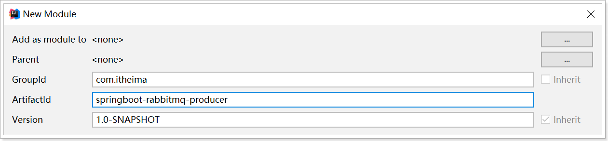
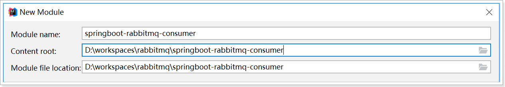

# Spring Boot整合RabbitMQ

## 1. 简介

在Spring项目中，可以使用Spring-Rabbit去操作RabbitMQ
https://github.com/spring-projects/spring-amqp

尤其是在spring boot项目中只需要引入对应的amqp启动器依赖即可，方便的使用RabbitTemplate发送消息，使用注解接收消息。

一般在开发过程中：

`生产者工程：`

1. application.yml文件配置$RabbitMQ$相关信息；
2. 在生产者工程中编写配置类，用于创建交换机和队列，并进行绑定

3. 注入RabbitTemplate对象，通过RabbitTemplate对象发送消息到交换机

`消费者工程：`

1. application.yml文件配置$RabbitMQ$相关信息

2. 创建消息处理类，用于接收队列中的消息并进行处理

## 2. 搭建生产者工程

### 2.1 创建工程

创建生产者工程springboot-rabbitmq-producer




### 2.2 添加依赖

修改pom.xml文件内容为如下：

```xml
<?xml version="1.0" encoding="UTF-8"?>
<project xmlns="http://maven.apache.org/POM/4.0.0"
         xmlns:xsi="http://www.w3.org/2001/XMLSchema-instance"
         xsi:schemaLocation="http://maven.apache.org/POM/4.0.0 http://maven.apache.org/xsd/maven-4.0.0.xsd">
    <modelVersion>4.0.0</modelVersion>

    <groupId>com.itheima</groupId>
    <artifactId>producer-springboot</artifactId>
    <version>1.0-SNAPSHOT</version>


    <!--
        1. 父工程依赖
    -->
    <parent>
        <groupId>org.springframework.boot</groupId>
        <artifactId>spring-boot-starter-parent</artifactId>
        <version>2.1.4.RELEASE</version>
    </parent>

    <dependencies>
        <!--2. rabbitmq-->
        <dependency>
            <groupId>org.springframework.boot</groupId>
            <artifactId>spring-boot-starter-amqp</artifactId>
        </dependency>
        <dependency>
            <groupId>org.springframework.boot</groupId>
            <artifactId>spring-boot-starter-test</artifactId>
        </dependency>
    </dependencies>


</project>
```

### 2.3 启动类

```java
package com.itheima;

import org.springframework.boot.SpringApplication;
import org.springframework.boot.autoconfigure.SpringBootApplication;

@SpringBootApplication
public class ProducerApplication {

    public static void main(String[] args) {
        SpringApplication.run(ProducerApplication.class);
    }
}
```

### 2.4 配置RabbitMQ

#### 配置文件

创建application.yml，内容如下：

```yml
# 配置RabbitMQ的基本信息  ip 端口 username  password..
spring:
  rabbitmq:
    host: 106.15.72.229 # ip
    port: 5672
    username: heima
    password: heima
    virtual-host: /itcast
```

#### 绑定交换机和队列

创建RabbitMQ队列与交换机绑定的配置类com.itheima.rabbitmq.config.RabbitMQConfig

```java
package com.itheima.rabbitmq.config;

import org.springframework.amqp.core.*;
import org.springframework.beans.factory.annotation.Qualifier;
import org.springframework.context.annotation.Bean;
import org.springframework.context.annotation.Configuration;

@Configuration
public class RabbitMQConfig {

    // 交换机名称
    public static final String EXCHANGE_NAME = "boot_topic_exchange";
    // 队列名称
    public static final String QUEUE_NAME = "boot_queue";

    //1.交换机
    @Bean("bootExchange")
    public Exchange bootExchange() {
        return ExchangeBuilder.topicExchange(EXCHANGE_NAME).durable(true).build();
    }


    //2.Queue 队列
    @Bean("bootQueue")
    public Queue bootQueue() {
        return QueueBuilder.durable(QUEUE_NAME).build();
    }

    //3. 队列和交互机绑定关系 Binding
    /*
        1. 知道哪个队列
        2. 知道哪个交换机
        3. routing key
     */
    @Bean
    public Binding bindQueueExchange(@Qualifier("bootQueue") Queue queue, @Qualifier("bootExchange") Exchange exchange) {
        return BindingBuilder.bind(queue).to(exchange).with("boot.#").noargs();
    }

}
```

## 3. 搭建消费者工程

### 3.1 创建工程

创建消费者工程springboot-rabbitmq-consumer




### 3.2 添加依赖

修改pom.xml文件内容为如下：

```xml
<?xml version="1.0" encoding="UTF-8"?>
<project xmlns="http://maven.apache.org/POM/4.0.0" xmlns:xsi="http://www.w3.org/2001/XMLSchema-instance"
         xsi:schemaLocation="http://maven.apache.org/POM/4.0.0 https://maven.apache.org/xsd/maven-4.0.0.xsd">
    <modelVersion>4.0.0</modelVersion>
    <parent>
        <groupId>org.springframework.boot</groupId>
        <artifactId>spring-boot-starter-parent</artifactId>
        <version>2.1.4.RELEASE</version>
        <relativePath/>
    </parent>
    <groupId>com.itheima</groupId>
    <artifactId>consumer-springboot</artifactId>
    <version>0.0.1-SNAPSHOT</version>

    <properties>
        <java.version>1.8</java.version>
    </properties>

    <dependencies>
        <!-- RabbitMQ 启动依赖-->
        <dependency>
            <groupId>org.springframework.boot</groupId>
            <artifactId>spring-boot-starter-amqp</artifactId>
        </dependency>

    </dependencies>

    <build>
        <plugins>
            <plugin>
                <groupId>org.springframework.boot</groupId>
                <artifactId>spring-boot-maven-plugin</artifactId>
            </plugin>
        </plugins>
    </build>

</project>
```

### 3.3 启动类

```java
package com.itheima.rabbitmq;

import org.springframework.boot.SpringApplication;
import org.springframework.boot.autoconfigure.SpringBootApplication;

@SpringBootApplication
public class ConsumerApplication {
    public static void main(String[] args) {
        SpringApplication.run(ConsumerApplication.class);
    }
}
```

### 3.4 配置RabbitMQ

创建application.yml，内容如下：

```yml
# 配置RabbitMQ的基本信息  ip 端口 username  password..
spring:
  rabbitmq:
    host: 106.15.72.229 # ip
    port: 5672
    username: heima
    password: heima
    virtual-host: /itcast
```

### 3.5 消息监听处理类

编写消息监听器com.itheima.rabbitmq.listener.RabbimtMQListener

```java
package com.itheima.consumerspringboot;

import org.springframework.amqp.core.Message;
import org.springframework.amqp.rabbit.annotation.RabbitListener;
import org.springframework.stereotype.Component;

@Component
public class RabbimtMQListener {

    // 
    @RabbitListener(queues = "boot_queue")
    public void ListenerQueue(Message message){
        //System.out.println(message);
        System.out.println(new String(message.getBody()));
    }

}
```

## 4. 测试

在生产者工程springboot-rabbitmq-producer中创建测试类，发送消息：

```java
package com.itheima.test;


import com.itheima.rabbitmq.config.RabbitMQConfig;
import org.junit.Test;
import org.junit.runner.RunWith;
import org.springframework.amqp.rabbit.core.RabbitTemplate;
import org.springframework.beans.factory.annotation.Autowired;
import org.springframework.boot.test.context.SpringBootTest;
import org.springframework.test.context.junit4.SpringRunner;

@SpringBootTest
@RunWith(SpringRunner.class)
public class ProducerTest {

    //1.注入RabbitTemplate
    @Autowired
    private RabbitTemplate rabbitTemplate;

    @Test
    public void testSend(){

        rabbitTemplate.convertAndSend(RabbitMQConfig.EXCHANGE_NAME,"boot.haha","boot mq hello~~~");
    }
}
```


先运行上述测试程序（交换机和队列才能先被声明和绑定），然后启动消费者；在消费者工程springboot-rabbitmq-consumer中控制台查看是否接收到对应消息。


另外；也可以在RabbitMQ的管理控制台中查看到交换机与队列的绑定：


# ☆